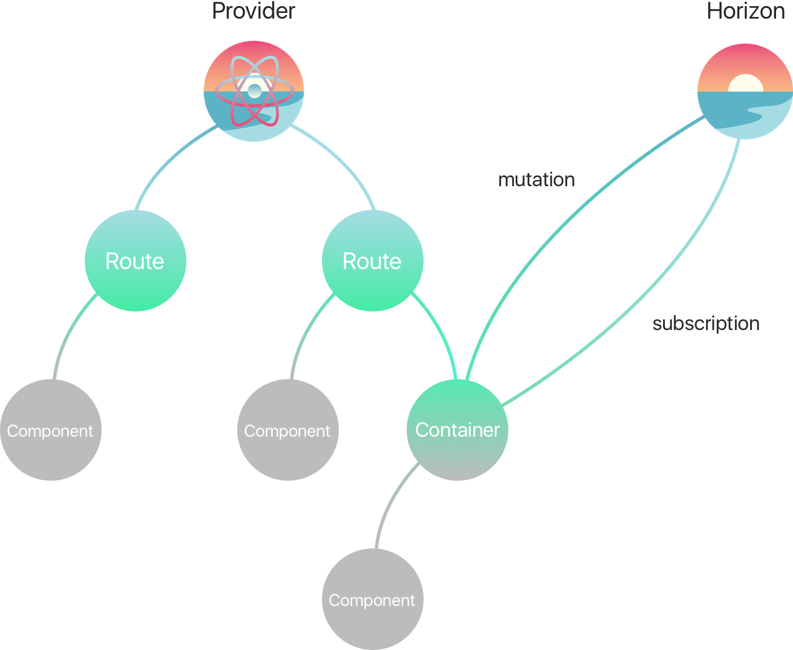

[](https://www.npmjs.com/package/react-hz)
[](https://travis-ci.org/roman01la/react-horizon)

# React Horizon


*React Horizon makes it easier to use your React application with horizon.io realtime backend*

## Installation
```
$ npm i react-hz
```

React Horizon allows reactive dataflow between backend and React.js application. Client demand is declared in React components using Horizon's query API and data is synchronized thanks to [horizon.io](http://horizon.io/) realtime backend.



## Running example
- Make sure you have installed RethinkDB and Horizon's CLI
- Start server from `example` directory: `$ hz serve --dev`
- Open http://127.0.0.1:8181 in your browser

## Usage

Read Horizon's [Collection API](http://horizon.io/api/collection/) for querying methods.

`react-hz` package provides `HorizonProvider` instance provider component, `HorizonRoute` application route component, connector function and `Horizon` client library.

### `<HorizonProvider />`
`HorizonProvider` is a top level component in your application which establishes connection to Horizon server. The component accepts an instance of `Horizon` constructor as `instance` prop.
```js
<HorizonProvider instance={horizonInstance}>
  <App />
</HorizonProvider>
```

### `Horizon([config])`
`Horizon` is a constructor function from Horizon's client library included into `react-hz`. Constructor function accepts optional config object http://horizon.io/api/horizon/#constructor.
```js
const horizonInstance = Horizon({ host: 'localhost:8181' });
```

### `<HorizonRoute />`
`HorizonRoute` is a top level component for every screen in your application which provides an API to respond to connectivity status changes.
Normally you should render your app in `renderSuccess` callback. `renderFailure` callback receives error object which can be used to render an error message.
```js
<HorizonRoute
  renderConnecting={() => <h1>Connecting...</h1>}
  renderDisconnected={() => <h1>You are offline</h1>}
  renderConnected={() => <h1>You are online</h1>}
  renderSuccess={() => <h1>Hello!</h1>}
  renderFailure={(error) => <h1>Something went wrong...</h1>} />
```

### `connect(component, config)`
`connect` function wraps React components with specified queries for subscriptions and mutations. Connector function expects two arguments: React component and subscriptions/mutations config object. Props passed into container component are automatically passed into wrapped component.
```js
const AppContainer = connect(App, {
  subscriptions: {
    // ...
  },
  mutations: {
    // ...
  }
});
```

### Subscriptions

`subscriptions` is a map of subscription names to query functions. Data behind query is available as a prop with the same name in React component. Query function receives Horizon `hz` function which should be used to construct a query using Horizon's Collection API and props object which is being passed into container component.

Behind the scenes React Horizon calls `watch` and `subscribe` function on query object which returns RxJS Observable and subscribes to incoming data. Data received by that observable is then passed into React component as props.

All subscriptions are unsubscribed automatically on `componentWillUnmount`.

```js
import React, { Component } from 'react';
import { render } from 'react-dom';
import { Horizon, HorizonProvider, connect } from 'react-hz';

class App extends Component {
  render() {

    const itemsSubcription = this.props.items;

    return (
      <ul>{itemsSubcription.map(({ id, title }) => <li key={id}>{title}</li>)}</ul>
    );
  }
}

const AppContainer = connect(App, {
  subscriptions: {
    items: (hz, { username }) => hz('items')
      .find({ username })
      .below({ id: 10 })
      .order('title', 'ascending')
  }
});

render((
  <HorizonProvider instance={Horizon()}>
    <AppContainer username='John' />
  </HorizonProvider>
), document.getElementById('app'));
```

### Mutations

`mutations` is a map of mutation query names to mutation query functions. Specified mutations are available as props in React component behind their corresponding names in config.

Available mutation operations:
- `remove` - http://horizon.io/api/collection/#remove
- `removeAll` - http://horizon.io/api/collection/#removeall
- `replace` - http://horizon.io/api/collection/#replace
- `store` - http://horizon.io/api/collection/#store
- `upsert` - http://horizon.io/api/collection/#upsert

It's possible to create two types of mutations (see example below):
- generic mutation which provides mutation object and thus gives you an ability to call different mutation operations in component
- specific mutation which is a function that receives parameters required for mutation, instantiates mutations object and applies mutation immediately

```js
import React, { Component } from 'react';
import { render } from 'react-dom';
import { Horizon, HorizonProvider, connect } from 'react-hz';

class App extends Component {
  render() {

    const itemsMutation = this.props.items;
    const removeItem = this.props.removeItem;

    return (
      <div>
        <button onClick={() => itemsMutation.store({ title: 'Item' })}>add</button>
        <button onClick={() => removeItem(24)}>remove</button>
      </div>
    );
  }
}

const AppContainer = connectHorizon(App, {
  mutations: {
    items: (hz) => hz('items'),
    removeItem: (hz) => (id) => hz('items').remove(id)
  }
});

render((
  <HorizonProvider instance={Horizon()}>
    <AppContainer />
  </HorizonProvider>
), document.getElementById('app'));
```

## Limitations

- **GraphQL**. GraphQL would be a much better declarative replacement instead of current Collection API. Horizon team is working on GraphQL adapter, follow [this thread](https://github.com/rethinkdb/horizon/issues/125) for updates.
- **Optimistic updates**. Optimistic updates feature is [being discussed](https://github.com/rethinkdb/horizon/issues/23) and it seems like it's not obvious at the moment if this should be baked into client library.
- **Offline**. [Offline support is not implemented yet](https://github.com/rethinkdb/horizon/issues/58).
- **Managing reconnection**. [Automatic reconnection is not implemented yet](https://github.com/rethinkdb/horizon/issues/9).

MIT
